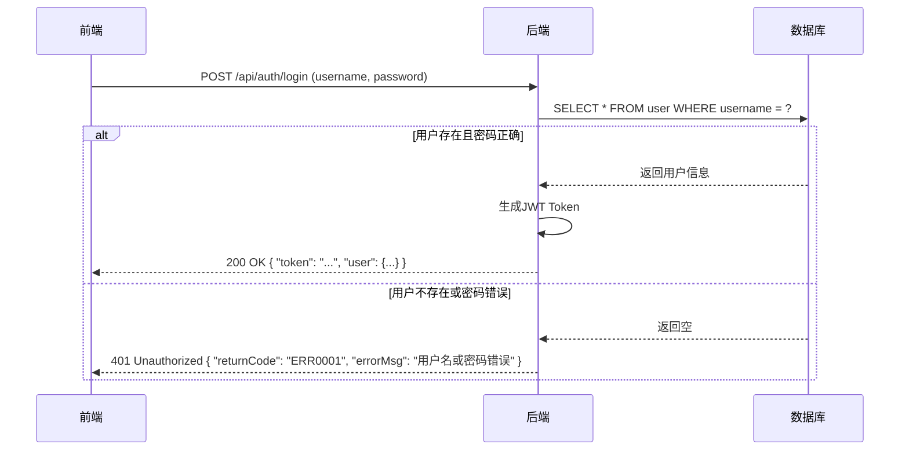
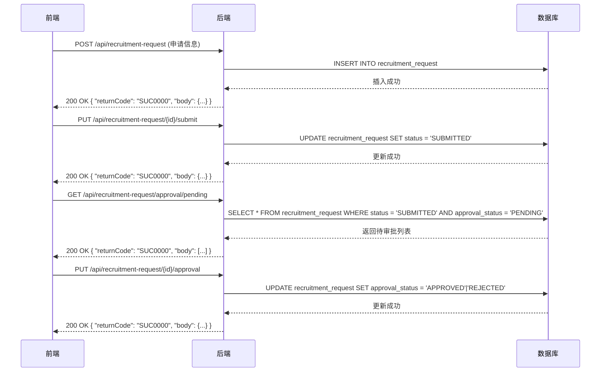

# 人力资源管理系统设计文档

## 1. 系统概述

### 1.1 系统简介

人力资源管理系统是一个基于前后端分离架构的企业级应用，旨在帮助企业高效管理人力资源相关业务流程，包括用人申请、审批管理、岗位发布、简历管理和面试安排等功能。系统采用现代化的技术栈，提供友好的用户界面和完善的权限管理机制。

### 1.2 系统目标

- 提供统一的人力资源管理平台，整合各个业务模块
- 实现业务流程的自动化和标准化，提高工作效率
- 提供完善的权限管理机制，确保数据安全
- 支持移动端访问，提高系统的可用性
- 提供数据分析和报表功能，辅助决策

## 2. 技术架构

### 2.1 技术栈选择

| 分类 | 技术 | 版本 | 选型理由 |
| :--- | :--- | :--- | :--- |
| 前端框架 | React | 18.x | 组件化开发，性能优异，生态成熟 |
| 构建工具 | Vite | 5.x | 快速的开发体验，高效的构建过程 |
| 路由管理 | React Router | 6.x | 灵活的路由配置，支持嵌套路由和路由保护 |
| 状态管理 | Context API | - | 轻量级状态管理，适合中小型应用 |
| UI组件库 | Ant Design | 5.x | 丰富的组件，美观的设计，良好的文档 |
| 后端框架 | Spring Boot | 2.7.x | 快速开发，内置Tomcat，生态丰富 |
| 持久层框架 | MyBatis | 3.x | 灵活的SQL映射，易于集成 |
| 数据库 | MySQL | 8.x | 稳定可靠，性能优异，广泛应用 |
| 认证方式 | JWT | - | 无状态认证，便于水平扩展 |

### 2.2 架构图

```
+------------------+       +------------------+       +------------------+
|                  |       |                  |       |                  |
|    前端应用       |       |    后端服务       |       |    数据库         |
|                  |       |                  |       |                  |
+------------------+       +------------------+       +------------------+
| React + Vite     |       | Spring Boot      |       | MySQL            |
| React Router     |<----->| Spring MVC       |<----->| InnoDB           |
| Ant Design       |       | MyBatis          |       |                  |
| Context API      |       | JWT              |       |                  |
|                  |       |                  |       |                  |
+------------------+       +------------------+
                               |
                               |
                       +------------------+
                       |                  |
                       |  外部服务          |
                       |                  |
                       +------------------+
                       | 文件存储 (S3)    |
                       |                  |
                       +------------------+
```

### 2.3 核心流程图

#### 2.3.1 登录流程



#### 2.3.2 用人申请流程



## 3. 前端设计

### 3.1 目录结构

```
frontend/
├── public/              # 静态资源
├── src/
│   ├── assets/          # 图片、图标等资源
│   ├── components/      # 组件
│   │   ├── Login.jsx           # 登录组件
│   │   ├── MainLayout.jsx      # 主布局组件
│   │   ├── Dashboard.jsx       # 仪表盘组件
│   │   ├── RecruitmentRequestList.jsx  # 用人申请列表组件
│   │   ├── RecruitmentRequestForm.jsx  # 用人申请表单组件
│   │   ├── ApprovalManagement.jsx      # 审批管理组件
│   │   ├── PositionPublishing.jsx      # 岗位发布组件
│   │   ├── ResumeSubmission.jsx        # 简历提交组件
│   │   ├── ResumeScreening.jsx         # 简历筛选组件
│   │   ├── InterviewScheduling.jsx     # 面试安排组件
│   │   ├── UserManagement.jsx          # 用户管理组件
│   │   ├── MessageManagement.jsx       # 消息管理组件
│   │   └── ProtectedRoute.jsx          # 路由保护组件
│   ├── contexts/        # 上下文
│   │   ├── AuthContext.jsx       # 认证上下文
│   │   └── MessageContext.jsx     # 消息上下文
│   ├── utils/           # 工具函数
│   │   └── api.js               # API请求封装
│   ├── App.jsx          # 应用入口
│   ├── App.css          # 全局样式
│   ├── main.jsx         # 渲染入口
│   └── index.css        # 基础样式
├── package.json         # 依赖配置
└── vite.config.js       # Vite配置
```

### 3.2 核心组件

#### 3.2.1 登录组件 (Login.jsx)

- **功能**：处理用户登录，验证用户名和密码
- **主要逻辑**：
  - 表单验证
  - 登录请求发送
  - JWT Token存储
  - 登录状态管理

#### 3.2.2 主布局组件 (MainLayout.jsx)

- **功能**：提供系统的整体布局，包括侧边菜单、顶部导航和内容区域
- **主要逻辑**：
  - 菜单显示控制
  - 响应式布局
  - 待办事项展示
  - 用户信息展示

#### 3.2.3 用人申请组件 (RecruitmentRequestList.jsx, RecruitmentRequestForm.jsx)

- **功能**：管理用人申请的创建、编辑和列表展示
- **主要逻辑**：
  - 表单提交和验证
  - 申请状态管理
  - 审批状态展示

#### 3.2.4 审批管理组件 (ApprovalManagement.jsx)

- **功能**：处理用人申请的审批流程
- **主要逻辑**：
  - 待审批列表展示
  - 审批操作处理
  - 审批历史记录

#### 3.2.5 简历管理组件 (ResumeSubmission.jsx, ResumeScreening.jsx)

- **功能**：处理简历的提交和筛选
- **主要逻辑**：
  - 简历上传
  - 简历状态管理
  - 筛选条件设置

#### 3.2.6 面试安排组件 (InterviewScheduling.jsx)

- **功能**：管理面试安排和面试记录
- **主要逻辑**：
  - 面试时间安排
  - 面试官分配
  - 面试结果记录

### 3.3 状态管理

系统使用React的Context API进行状态管理，主要包括以下上下文：

#### 3.3.1 认证上下文 (AuthContext.jsx)

- **功能**：管理用户登录状态和权限
- **主要状态**：
  - user：当前登录用户信息
  - isAuthenticated：是否已认证
  - isLoading：加载状态
- **主要方法**：
  - login：登录方法
  - logout：登出方法
  - hasMenuAccess：菜单权限检查

#### 3.3.2 消息上下文 (MessageContext.jsx)

- **功能**：管理系统消息
- **主要状态**：
  - messages：消息列表
  - unreadCount：未读消息数量
- **主要方法**：
  - addMessage：添加消息
  - markAsRead：标记消息为已读
  - deleteMessage：删除消息

### 3.4 路由设计

| 路径 | 组件 | 权限要求 | 描述 |
| :--- | :--- | :--- | :--- |
| /login | Login | 无 | 登录页面 |
| / | 重定向到 /login | 无 | 根路径重定向 |
| /dashboard | Dashboard | 已登录 | 仪表盘页面 |
| /recruitment-request | RecruitmentRequestList | 已登录 | 用人申请列表 |
| /recruitment-request/new | RecruitmentRequestForm | 已登录 | 新建用人申请 |
| /recruitment-request/edit/:id | RecruitmentRequestForm | 已登录 | 编辑用人申请 |
| /approval-management | ApprovalManagement | 已登录 | 审批管理页面 |
| /position-publishing | PositionPublishing | 已登录 | 岗位发布页面 |
| /resume-submission | ResumeSubmission | 已登录 | 简历提交页面 |
| /resume-screening | ResumeScreening | 已登录 | 简历筛选页面 |
| /interview-scheduling | InterviewScheduling | 已登录 | 面试安排页面 |
| /user-management | UserManagement | 已登录 | 用户管理页面 |
| /message-management | MessageManagement | 已登录 | 消息管理页面 |

## 4. 后端设计

### 4.1 目录结构

```
backend/recruitment-system/
src/
├── main/
│   ├── java/com/hr/
│   │   ├── config/            # 配置类
│   │   │   ├── WebMvcConfig.java       # MVC配置
│   │   │   ├── DatabaseInitializer.java  # 数据库初始化
│   │   │   └── CacheControlInterceptor.java  # 缓存拦截器
│   │   ├── controller/        # 控制器
│   │   │   ├── AuthController.java           # 认证控制器
│   │   │   ├── RecruitmentRequestController.java  # 用人申请控制器
│   │   │   ├── ResumeController.java          # 简历控制器
│   │   │   ├── InterviewRecordController.java  # 面试记录控制器
│   │   │   ├── FileUploadController.java       # 文件上传控制器
│   │   │   └── UserController.java            # 用户控制器
│   │   ├── entity/            # 实体类
│   │   │   ├── User.java                  # 用户实体
│   │   │   ├── Role.java                  # 角色实体
│   │   │   ├── Permission.java            # 权限实体
│   │   │   ├── RecruitmentRequest.java    # 用人申请实体
│   │   │   ├── Resume.java                # 简历实体
│   │   │   └── InterviewRecord.java       # 面试记录实体
│   │   ├── mapper/            # Mapper接口
│   │   │   ├── UserMapper.java             # 用户Mapper
│   │   │   ├── RecruitmentRequestMapper.java  # 用人申请Mapper
│   │   │   ├── ResumeMapper.java           # 简历Mapper
│   │   │   └── InterviewRecordMapper.java  # 面试记录Mapper
│   │   ├── service/           # 服务层
│   │   │   ├── impl/          # 实现类
│   │   │   ├── UserService.java            # 用户服务
│   │   │   ├── RecruitmentRequestService.java  # 用人申请服务
│   │   │   ├── ResumeService.java          # 简历服务
│   │   │   ├── InterviewRecordService.java  # 面试记录服务
│   │   │   └── ConfigService.java          # 配置服务
│   │   └── RecruitmentSystemApplication.java  # 应用入口
│   └── resources/
│       ├── mapper/           # XML映射文件
│       ├── application.properties  # 应用配置
│       └── schema.sql        # 数据库表结构
└── pom.xml                  # Maven依赖
```

### 4.2 核心模块

#### 4.2.1 认证模块

- **功能**：处理用户认证和授权
- **主要API**：
  - POST /api/auth/login：用户登录
  - POST /api/auth/logout：用户登出
  - GET /api/auth/me：获取当前用户信息

#### 4.2.2 用人申请模块

- **功能**：管理用人申请的生命周期
- **主要API**：
  - POST /api/recruitment-request：创建用人申请
  - GET /api/recruitment-request：获取用人申请列表
  - GET /api/recruitment-request/{id}：获取用人申请详情
  - PUT /api/recruitment-request/{id}：更新用人申请
  - PUT /api/recruitment-request/{id}/submit：提交用人申请
  - PUT /api/recruitment-request/{id}/approval：审批用人申请

#### 4.2.3 简历模块

- **功能**：管理简历的提交和筛选
- **主要API**：
  - POST /api/resume：提交简历
  - GET /api/resume：获取简历列表
  - GET /api/resume/{id}：获取简历详情
  - PUT /api/resume/{id}/status：更新简历状态
  - POST /api/resume/upload：上传简历文件

#### 4.2.4 面试模块

- **功能**：管理面试安排和面试记录
- **主要API**：
  - POST /api/interview：创建面试记录
  - GET /api/interview：获取面试记录列表
  - GET /api/interview/{id}：获取面试记录详情
  - PUT /api/interview/{id}：更新面试记录
  - PUT /api/interview/{id}/result：更新面试结果

#### 4.2.5 文件上传模块

- **功能**：处理文件上传和下载
- **主要API**：
  - POST /api/file/upload：上传文件
  - GET /api/file/{id}：下载文件
  - GET /api/file/{id}/preview：预览文件

### 4.3 数据模型

#### 4.3.1 用户 (User)

| 字段名 | 数据类型 | 描述 |
| :--- | :--- | :--- |
| user_id | VARCHAR(20) | 用户ID |
| username | VARCHAR(50) | 用户名 |
| password | VARCHAR(255) | 密码 |
| real_name | VARCHAR(50) | 真实姓名 |
| department | VARCHAR(100) | 部门 |
| position | VARCHAR(100) | 职位 |
| status | VARCHAR(20) | 状态 |
| create_time | DATETIME | 创建时间 |
| create_user_id | VARCHAR(20) | 创建用户ID |
| create_user_name | VARCHAR(50) | 创建用户姓名 |
| update_time | DATETIME | 更新时间 |
| update_user_id | VARCHAR(20) | 更新用户ID |
| update_user_name | VARCHAR(50) | 更新用户姓名 |

#### 4.3.2 用人申请 (RecruitmentRequest)

| 字段名 | 数据类型 | 描述 |
| :--- | :--- | :--- |
| recruitment_request_id | BIGINT | 用人申请ID |
| request_title | VARCHAR(255) | 申请标题 |
| total_recruitment_count | INT | 总编制人数 |
| vacancy_count | INT | 空缺编制 |
| interviewer | VARCHAR(100) | 面试官 |
| position_or_team | VARCHAR(255) | 岗位/用人班组 |
| team_manager | VARCHAR(100) | 所属团队经理 |
| category | VARCHAR(50) | 所属分类 |
| technical_platform | VARCHAR(50) | 技术平台 |
| type | VARCHAR(50) | 所属类型 |
| supplement_count | INT | 补充人数 |
| urgent_requirement | VARCHAR(10) | 是否近期紧急要求 |
| proposed_level | VARCHAR(50) | 建议级别 |
| experience_years | VARCHAR(50) | 相关经验年限要求 |
| position_responsibility | TEXT | 岗位职责 |
| status | VARCHAR(20) | 状态 |
| approval_status | VARCHAR(20) | 审批状态 |
| create_time | DATETIME | 创建时间 |
| create_user_id | VARCHAR(20) | 创建用户ID |
| create_user_name | VARCHAR(50) | 创建用户姓名 |
| update_time | DATETIME | 更新时间 |
| update_user_id | VARCHAR(20) | 更新用户ID |
| update_user_name | VARCHAR(50) | 更新用户姓名 |

#### 4.3.3 简历 (Resume)

| 字段名 | 数据类型 | 描述 |
| :--- | :--- | :--- |
| resume_id | BIGINT | 简历ID |
| recruitment_request_id | BIGINT | 招聘申请ID |
| job_title | VARCHAR(255) | 岗位标题 |
| applicant_name | VARCHAR(50) | 申请人姓名 |
| contact_phone | VARCHAR(20) | 联系电话 |
| email | VARCHAR(100) | 邮箱 |
| education | VARCHAR(50) | 学历 |
| work_experience | VARCHAR(255) | 工作经验 |
| resume_file_name | VARCHAR(255) | 简历文件名 |
| resume_file_url | VARCHAR(255) | 简历文件URL |
| status | VARCHAR(20) | 简历状态 |
| interview_status | VARCHAR(20) | 面试状态 |
| create_time | DATETIME | 创建时间 |
| create_user_id | VARCHAR(20) | 创建用户ID |
| create_user_name | VARCHAR(50) | 创建用户姓名 |
| update_time | DATETIME | 更新时间 |
| update_user_id | VARCHAR(20) | 更新用户ID |
| update_user_name | VARCHAR(50) | 更新用户姓名 |

#### 4.3.4 面试记录 (InterviewRecord)

| 字段名 | 数据类型 | 描述 |
| :--- | :--- | :--- |
| interview_record_id | BIGINT | 面试记录ID |
| resume_id | BIGINT | 简历ID |
| recruitment_request_id | BIGINT | 招聘申请ID |
| interview_round | VARCHAR(20) | 面试环节 |
| interviewer_id | VARCHAR(20) | 面试官ID |
| interviewer_name | VARCHAR(50) | 面试官姓名 |
| interviewer_role | VARCHAR(20) | 面试官角色 |
| interview_time | DATETIME | 面试时间 |
| interview_result | VARCHAR(20) | 面试结果 |
| interview_comment | TEXT | 面试评语 |
| create_time | DATETIME | 创建时间 |
| create_user_id | VARCHAR(20) | 创建用户ID |
| create_user_name | VARCHAR(50) | 创建用户姓名 |
| update_time | DATETIME | 更新时间 |
| update_user_id | VARCHAR(20) | 更新用户ID |
| update_user_name | VARCHAR(50) | 更新用户姓名 |

## 5. 系统功能

### 5.1 核心功能模块

#### 5.1.1 登录与认证

- 用户登录和登出
- JWT Token管理
- 权限验证和授权
- 会话管理

#### 5.1.2 仪表盘

- 系统概览
- 待办事项提醒
- 最近活动记录
- 关键指标展示

#### 5.1.3 用人申请管理

- 用人申请创建和编辑
- 申请状态跟踪
- 申请审批流程
- 申请历史记录

#### 5.1.4 审批管理

- 待审批列表
- 审批操作
- 审批历史记录
- 审批统计分析

#### 5.1.5 岗位发布

- 岗位信息管理
- 发布状态控制
- 岗位申请管理
- 岗位统计分析

#### 5.1.6 简历管理

- 简历提交和上传
- 简历筛选和评估
- 简历状态跟踪
- 简历库管理

#### 5.1.7 面试安排

- 面试时间安排
- 面试官分配
- 面试结果记录
- 面试反馈管理

#### 5.1.8 消息管理

- 系统消息推送
- 消息状态管理
- 消息历史记录
- 消息统计分析

### 5.2 辅助功能

#### 5.2.1 用户管理

- 用户信息管理
- 角色和权限分配
- 用户状态控制
- 用户活动审计

#### 5.2.2 系统设置

- 系统参数配置
- 通知模板管理
- 数据备份和恢复
- 系统日志查看

#### 5.2.3 报表分析

- 招聘数据分析
- 面试结果分析
- 员工流动分析
- 人力资源成本分析

## 6. 部署与运维

### 6.1 部署架构

- **开发环境**：本地开发环境，使用Vite开发服务器和Spring Boot内置Tomcat
- **测试环境**：独立的测试服务器，模拟生产环境配置
- **生产环境**：
  - 前端：Nginx作为静态资源服务器
  - 后端：Tomcat或Docker容器
  - 数据库：独立的MySQL服务器
  - 缓存：Redis用于缓存和会话管理

### 6.2 部署流程

1. **前端部署**：
   - 执行 `npm run build` 构建静态资源
   - 将构建产物部署到Nginx或CDN

2. **后端部署**：
   - 执行 `mvn clean package` 构建WAR包
   - 将WAR包部署到Tomcat或Docker容器
   - 配置数据库连接和环境变量

3. **数据库部署**：
   - 创建数据库和表结构
   - 初始化基础数据
   - 配置数据库参数

### 6.3 监控与维护

- **系统监控**：使用Prometheus和Grafana监控系统运行状态
- **日志管理**：使用ELK栈收集和分析日志
- **备份策略**：定期备份数据库和配置文件
- **故障处理**：建立故障处理流程和应急预案

## 7. 安全设计

### 7.1 认证与授权

- **JWT认证**：使用JSON Web Token进行无状态认证
- **密码加密**：用户密码使用BCrypt加密存储
- **权限控制**：基于角色的访问控制(RBAC)
- **会话管理**：合理的Token过期时间和刷新机制

### 7.2 数据安全

- **数据加密**：敏感数据加密存储
- **数据备份**：定期备份数据，确保数据可恢复
- **数据脱敏**：在非必要场景下对敏感数据进行脱敏处理
- **访问控制**：严格控制数据访问权限

### 7.3 网络安全

- **HTTPS**：使用HTTPS加密传输
- **CORS配置**：合理配置跨域资源共享
- **防火墙**：配置防火墙规则，限制访问
- **DDoS防护**：部署DDoS防护措施

### 7.4 应用安全

- **输入验证**：严格验证用户输入
- **SQL注入防护**：使用参数化查询，防止SQL注入
- **XSS防护**：防止跨站脚本攻击
- **CSRF防护**：防止跨站请求伪造

## 8. 性能优化

### 8.1 前端优化

- **代码分割**：使用动态导入，减少初始加载时间
- **缓存策略**：合理使用浏览器缓存
- **图片优化**：使用适当的图片格式和大小
- **组件懒加载**：延迟加载非关键组件
- **状态管理优化**：避免不必要的重渲染

### 8.2 后端优化

- **数据库优化**：合理设计索引，优化SQL查询
- **缓存策略**：使用Redis缓存热点数据
- **连接池配置**：优化数据库连接池
- **异步处理**：使用异步方式处理耗时操作
- **负载均衡**：部署多实例，实现负载均衡

### 8.3 数据库优化

- **索引优化**：合理创建和使用索引
- **表结构优化**：规范化表结构，避免冗余
- **查询优化**：优化SQL语句，减少查询开销
- **分区表**：对大表使用分区表
- **读写分离**：实现数据库读写分离

## 9. 总结与展望

### 9.1 系统特点

- **模块化设计**：系统采用模块化设计，便于维护和扩展
- **现代化技术栈**：使用React、Spring Boot等现代化技术
- **完善的权限管理**：基于角色的访问控制，确保数据安全
- **友好的用户界面**：使用Ant Design，提供美观的用户界面
- **灵活的配置**：支持多种配置方式，适应不同环境

### 9.2 未来展望

- **移动端适配**：开发移动端应用，提高系统的可用性
- **AI辅助招聘**：引入AI技术，辅助简历筛选和面试评估
- **数据分析增强**：提供更丰富的数据分析和可视化功能
- **集成第三方系统**：与企业其他系统集成，实现数据互通
- **微服务架构**：考虑采用微服务架构，提高系统的可扩展性

### 9.3 结论

人力资源管理系统是一个功能完善、架构合理的企业级应用，能够满足企业人力资源管理的各种需求。系统采用现代化的技术栈，提供友好的用户界面和完善的权限管理机制，具有良好的可扩展性和可维护性。

通过本系统的实施，企业可以实现人力资源管理的自动化和标准化，提高工作效率，降低管理成本，同时为决策提供有力的数据支持。未来，系统可以通过不断的优化和扩展，适应企业发展的需要，成为企业数字化转型的重要组成部分。